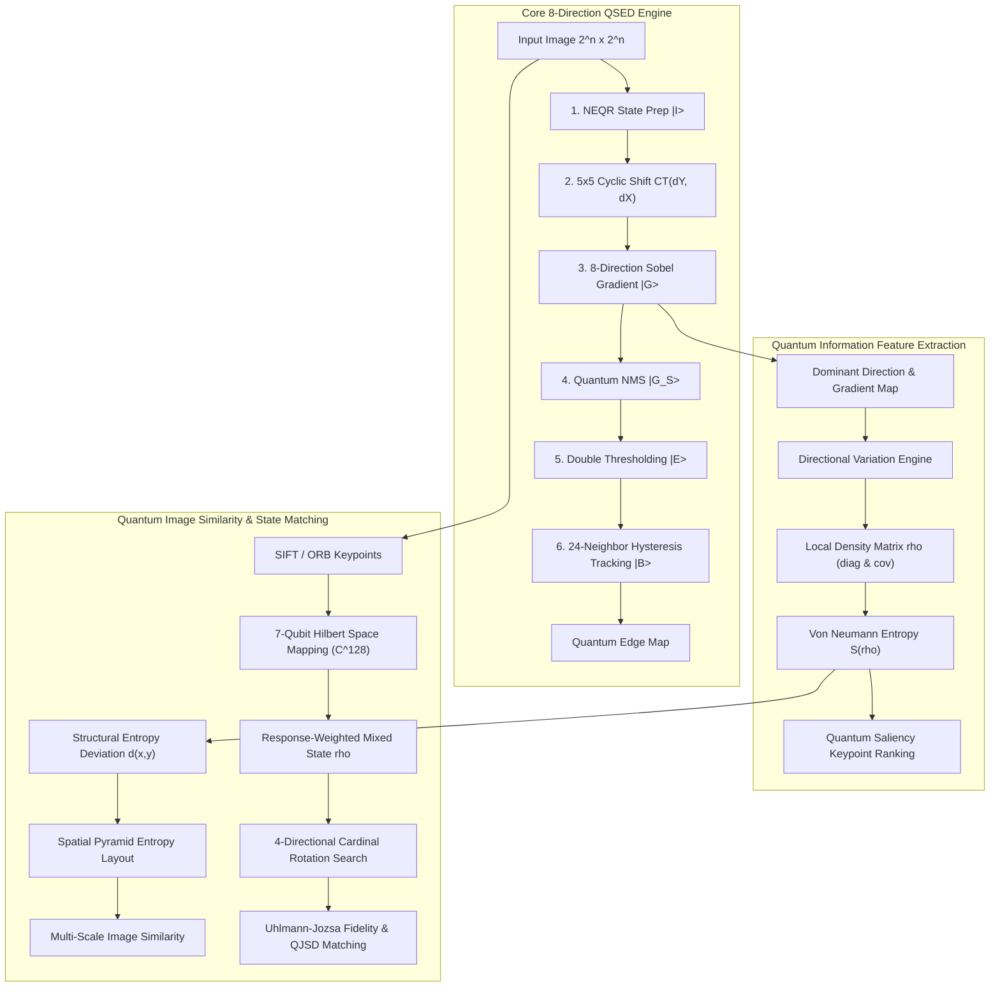
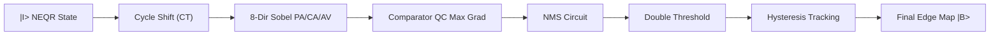
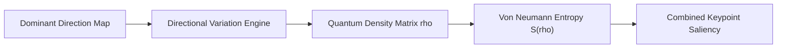
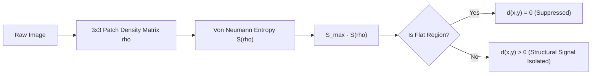

# Quantum Image Edge Detection (QSED) & Quantum Computer Vision Framework

> **Official Research Reproduction, Feature Engineering & Quantum State Matching Reference**  
> **Original Paper**: *Quantum image edge detection based on eight-direction Sobel operator for NEQR*  
> **Authors**: Wenjie Liu, Lu Wang  
> **Affiliation**: School of Computer Science & School of Automation, Nanjing University of Information Science and Technology, Nanjing, China  
> **arXiv Reference**: [arXiv:2310.00370 [quant-ph]](https://arxiv.org/abs/2310.00370)  
> **Extended Architecture**: Von Neumann Entropy Similarity, Directional Variation Keypoints, Uhlmann Fidelity & 7-Qubit SIFT Density Matrix Matching

---

## Abstract

Quantum Image Edge Detection (QSED) is an emerging paradigm in quantum image processing (QIP) that leverages quantum superposition, entanglement, and reversible unitary transformations to resolve the exponential computational bottleneck encountered by classical edge detection algorithms on high-definition digital imagery. While traditional QSED algorithms consider only two-direction ($0^\circ, 90^\circ$) or four-direction ($0^\circ, 45^\circ, 90^\circ, 135^\circ$) operators, this framework implements the **novel eight-direction Sobel operator for Novel Enhanced Quantum Representation (NEQR)** images over a $5 \times 5$ spatial window.

Beyond edge extraction, this repository features an end-to-end **Quantum Computer Vision (Quantum_CV)** architecture:
1. **End-to-End Reversible Quantum Circuit Pipeline**: NEQR state preparation, cyclic shift transformations, 8-directional parallel gradient computation, non-maximum suppression (NMS), double thresholding, and 24-neighborhood hysteresis edge tracking with $\mathcal{O}(n^2 + q^2)$ execution complexity.
2. **Quantum Information-Theoretic Feature Extraction**: Directional variation analysis and local density matrix formulation ($\rho$) evaluated under Von Neumann entropy ($S(\rho) = -\text{Tr}(\rho \log_2 \rho)$).
3. **Quantum Image Similarity Using Von Neumann Entropy**: Resolves natural image entropy saturation via multi-scale structural entropy deviation and spatial pyramid pooling.
4. **Quantum SIFT/SURF State Matcher**: Maps 128-dimensional keypoint descriptors into a **7-qubit Hilbert space** ($\mathbb{C}^{128}$), constructing mixed-state ensemble density matrices evaluated via **Uhlmann-Jozsa Fidelity**, **Quantum Jensen-Shannon Divergence (QJSD)**, and 4-directional cardinal rotation optimization ($0^\circ, 90^\circ, 180^\circ, 270^\circ$).

---

## System Architecture Overview



---

## Table of Contents

1. [Paper Overview & Contributions](#paper-overview--contributions)
2. [Quantum Computing & NEQR Foundations](#quantum-computing--neqr-foundations)
3. [Core QSED Quantum Circuit Pipeline](#core-qsed-quantum-circuit-pipeline)
   - [1. Quantum Image Shift Transformation (CT)](#1-quantum-image-shift-transformation-ct)
   - [2. Eight-Direction Sobel Gradient Calculation](#2-eight-direction-sobel-gradient-calculation)
   - [3. Quantum Non-Maximum Suppression (NMS)](#3-quantum-non-maximum-suppression-nms)
   - [4. Quantum Double Threshold Detection](#4-quantum-double-threshold-detection)
   - [5. Quantum Hysteresis Edge Tracking](#5-quantum-hysteresis-edge-tracking)
4. [Quantum Feature Extraction & Von Neumann Entropy](#quantum-feature-extraction--von-neumann-entropy)
   - [Directional Variation Analysis](#directional-variation-analysis)
   - [Density Matrix Formulations](#density-matrix-formulations)
   - [Von Neumann Entropy Engine](#von-neumann-entropy-engine)
   - [Quantum Saliency Keypoint Ranking](#quantum-saliency-keypoint-ranking)
5. [Quantum Image Similarity Using Von Neumann Entropy (In-Depth)](#quantum-image-similarity-using-von-neumann-entropy-in-depth)
   - [Mathematical Formulation of S(rho)](#mathematical-formulation-of-srho)
   - [The Natural Image Entropy Saturation Trap](#the-natural-image-entropy-saturation-trap)
   - [Structural Entropy Deviation d(x, y)](#structural-entropy-deviation-dx-y)
   - [The 3-Tier Multi-Scale Similarity Metrics](#the-3-tier-multi-scale-similarity-metrics)
   - [Global SIFT Density Matrix Matching & QJSD](#global-sift-density-matrix-matching--qjsd)
6. [Repository & Git Setup Guide](#repository--git-setup-guide)
7. [Installation & Setup](#installation--setup)
8. [Complete Execution Guide (CLI)](#complete-execution-guide-cli)
   - [1. Core QSED Edge Detection & Demo](#1-core-qsed-edge-detection--demo)
   - [2. Quantum Dense Structural Similarity](#2-quantum-dense-structural-similarity)
   - [3. Quantum SIFT / Pixel Density Matrix Matching](#3-quantum-sift--pixel-density-matrix-matching)
   - [4. Quantum Keypoint Entropy & Experiments](#4-quantum-keypoint-entropy--experiments)
   - [5. Full Visual Match Report Dashboard](#5-full-visual-match-report-dashboard)
9. [Experimental Results & Benchmarks](#experimental-results--benchmarks)
10. [Complexity Analysis](#complexity-analysis)
11. [References](#references)

---

## Paper Overview & Contributions

| Property | Details |
| :--- | :--- |
| **Title** | Quantum image edge detection based on eight-direction Sobel operator for NEQR |
| **Authors** | Wenjie Liu, Lu Wang |
| **Institution** | Nanjing University of Information Science and Technology (NUIST) |
| **Publication Date**| October 2023 (arXiv:2310.00370v1) |
| **Core Innovation** | $5 \times 5$ Eight-Direction Sobel Operator with an end-to-end reversible quantum circuit pipeline |
| **Circuit Complexity**| $\mathcal{O}(n^2 + q^2)$ for $2^n \times 2^n$ images with $q$-bit grayscale precision |

### Main Theoretical Advances
1. **$5 \times 5$ Eight-Direction Sobel Operator**: Formulates directional templates for $0^\circ, 22.5^\circ, 45^\circ, 67.5^\circ, 90^\circ, 112.5^\circ, 135^\circ, 157.5^\circ$, capturing fine sub-diagonal contours that $3 \times 3$ filters miss.
2. **Reversible Quantum Circuit Architecture**: Replaces classical post-processing with reversible quantum building blocks: Quantum Comparator (QC), Cycle Shift (CT), Parallel Adder (PA), Two's Complement (CA), Absolute Value (AV), and Double Operation (DO).
3. **Simultaneous Superposition Evaluation**: Computes all 8 directional gradients across all $2^{2n}$ pixels in parallel in quantum superposition using $24q$ auxiliary qubits.
4. **Exponential Acceleration**: Reduces runtime from classical $\mathcal{O}(2^{2n})$ to circuit depth $\mathcal{O}(n^2 + q^2)$.

---

## Quantum Computing & NEQR Foundations

### Quantum Gates Summary

| Gate | Symbol | Matrix Representation | Function |
| :--- | :---: | :---: | :--- |
| **Hadamard** | $H$ | $\frac{1}{\sqrt{2}} \begin{bmatrix} 1 & 1 \\ 1 & -1 \end{bmatrix}$ | Creates equal superposition: $H\vert 0\rangle = \frac{\vert 0\rangle + \vert 1\rangle}{\sqrt{2}}$ |
| **Pauli-X** | $X$ | $\begin{bmatrix} 0 & 1 \\ 1 & 0 \end{bmatrix}$ | Bit-flip (Quantum NOT): $X\vert 0\rangle = \vert 1\rangle$ |
| **CNOT** | $CX$ | $\begin{bmatrix} 1 & 0 & 0 & 0 \\ 0 & 1 & 0 & 0 \\ 0 & 0 & 0 & 1 \\ 0 & 0 & 1 & 0 \end{bmatrix}$ | Controlled-NOT: Flips target if control is $\vert 1\rangle$ |
| **Toffoli** | $CCX$ | $8 \times 8$ Permutation Matrix | Controlled-Controlled-NOT |
| **SWAP** | $SWAP$ | $\begin{bmatrix} 1 & 0 & 0 & 0 \\ 0 & 0 & 1 & 0 \\ 0 & 1 & 0 & 0 \\ 0 & 0 & 0 & 1 \end{bmatrix}$ | Swaps states between two qubits |

### Novel Enhanced Quantum Representation (NEQR)

NEQR encodes grayscale values directly into a computational basis register $|C_{YX}\rangle$ rather than probability amplitudes, allowing exact multi-bit retrieval:

$$|I\rangle = \frac{1}{2^n} \sum_{Y=0}^{2^n-1} \sum_{X=0}^{2^n-1} |C_{YX}\rangle |Y\rangle |X\rangle$$

where:
- $|C_{YX}\rangle = |C_{q-1} C_{q-2} \dots C_0\rangle, \quad C_k \in \{0, 1\}$ ($q$-qubit grayscale value).
- $|Y\rangle = |Y_{n-1} \dots Y_0\rangle$ and $|X\rangle = |X_{n-1} \dots X_0\rangle$ ($n$-qubit spatial coordinates).

---

## Core QSED Quantum Circuit Pipeline



### 1. Quantum Image Shift Transformation (CT)
Simultaneously translates coordinates of all pixels across the superposition by $\pm 1$ or $\pm 2$ along the X and Y axes using controlled modular increment/decrement circuits:
$$\text{CT}(+1)|Y\rangle = |(Y+1) \bmod 2^n\rangle, \quad \text{CT}(-1)|Y\rangle = |(Y-1) \bmod 2^n\rangle$$
This enables retrieval of the 24 neighbor pixels in a $5 \times 5$ window without querying classical memory.

### 2. Eight-Direction Sobel Gradient Calculation
Eight directional convolution templates ($G_0, G_{22.5}, G_{45}, G_{67.5}, G_{90}, G_{112.5}, G_{135}, G_{157.5}$) are applied simultaneously using:
- **Parallel Adder (PA)**: Reversible addition $|A + B\rangle$.
- **Complement Operation (CA)**: Two's complement for signed difference.
- **Double Operation (DO)**: Reversible bit-shift multiplication by 2 and 4.
- **Absolute Value (AV)**: Computes $|A - B|$.
- **Quantum Comparator (QC)**: Determines dominant direction:
  $$|G\rangle = \max_{k \in \{0^\circ, \dots, 157.5^\circ\}} |G_k|$$

### 3. Quantum Non-Maximum Suppression (NMS)
Suppresses non-peak edge pixels along the gradient normal:
$$|G_S\rangle = \frac{1}{2^n} \sum_{Y=0}^{2^n-1} \sum_{X=0}^{2^n-1} |M\rangle |G\rangle |Y\rangle |X\rangle$$
where auxiliary qubit $|M\rangle = |1\rangle$ if $|G(Y,X)\rangle$ exceeds both forward and backward directional neighbors, and $|0\rangle$ otherwise.

### 4. Quantum Double Threshold Detection
Classifies candidates using high ($T_H$) and low ($T_L = \frac{1}{3}T_H$) thresholds into a 2-qubit register $|E_{YX}\rangle$:
- Strong edge: $|E_{YX}\rangle = |10\rangle \quad (G \ge T_H)$
- Weak edge: $|E_{YX}\rangle = |01\rangle \quad (T_L \le G < T_H)$
- Non-edge: $|E_{YX}\rangle = |00\rangle \quad (G < T_L)$

### 5. Quantum Hysteresis Edge Tracking
Connects weak edges ($|01\rangle$) to confirmed edges ($|B_{YX}\rangle = |1\rangle$) if at least one 24-neighbor in the $5 \times 5$ window is a strong edge ($|10\rangle$).

---

## Quantum Feature Extraction & Von Neumann Entropy

To bridge low-level edge detection with high-level computer vision, the framework introduces a quantum information-theoretic feature extraction engine (`src/feature/`).



### Directional Variation Analysis
Measures orientation turbulence within a localized neighborhood:
- Computes circular angular differences between dominant gradient angles:
  $$\Delta \theta(\theta_1, \theta_2) = \min(|\theta_1 - \theta_2|, 180^\circ - |\theta_1 - \theta_2|)$$
- Quantifies local directional variance $\text{Var}_{\text{dir}}(Y, X)$.
- Corner and junction keypoints exhibit high directional entropy, distinguishing structural vertices from uniform straight edges.

### Density Matrix Formulations
For a local image patch or feature manifold, a quantum density matrix $\rho$ is constructed satisfying $\rho = \rho^\dagger$, $\text{Tr}(\rho) = 1$, and $\rho \succeq 0$:

1. **Intensity Diagonal Density Matrix (Method A)**:
   For a $k \times k$ patch vector $\mathbf{v}$:
   $$q_i = \frac{v_i + \epsilon}{\sum_j (v_j + \epsilon)}, \quad \rho_{\text{intensity}} = \text{diag}(q_0, q_1, \dots, q_{k^2-1})$$
   *(Avoids rank-1 pure state collapse $\rho = |\psi\rangle\langle\psi|$ which trivially forces $S(\rho)=0$ everywhere).*

2. **Covariance Feature Density Matrix (Method B)**:
   For local feature vectors $X \in \mathbb{R}^{N \times d}$:
   $$C = \frac{1}{N} (X - \mu)^T (X - \mu) + \epsilon I, \quad \rho_{\text{cov}} = \frac{C}{\text{Tr}(C)}$$

### Von Neumann Entropy Engine
Computes the quantum entropy from density matrix eigenspectra $\{\lambda_i\}$:
$$S(\rho) = -\text{Tr}(\rho \log_2 \rho) = -\sum_{\lambda_i > 0} \lambda_i \log_2(\lambda_i)$$
Normalized across dimensions $d$:
$$S_{\text{norm}}(\rho) = \frac{S(\rho)}{\log_2(d)} \in [0, 1]$$

### Quantum Saliency Keypoint Ranking
Selects stable, repeatable keypoints using a composite quantum saliency objective:
$$\text{Score}(Y,X) = \alpha \cdot \text{Score}_{\text{kp}}(Y,X) + (1 - \alpha) \cdot S_{\text{norm}}(Y,X)$$
where $\text{Score}_{\text{kp}} = |\nabla I| \times \text{Var}_{\text{dir}}$.

---

## Quantum Image Similarity Using Von Neumann Entropy (In-Depth)

This repository features a dedicated, mathematically rigorous engine for evaluating **image similarity via Von Neumann entropy** (`src/feature/similarity.py` and `scripts/run_similarity.py`).

### Mathematical Formulation of S(rho)
For an image $I$, every $3 \times 3$ sliding patch contains 9 intensity values $\mathbf{v} = [v_0, v_1, \dots, v_8]^T$.
We normalize $\mathbf{v}$ into a 9-dimensional probability simplex $\mathbf{q}$:
$$q_i = \frac{v_i + \epsilon}{\sum_{j=0}^8 (v_j + \epsilon)}, \quad \sum_{i=0}^8 q_i = 1, \quad \epsilon = 10^{-10}$$
The corresponding mixed-state quantum density operator is:
$$\rho(x, y) = \sum_{i=0}^8 q_i |i\rangle\langle i| = \text{diag}(q_0, q_1, \dots, q_8)$$
The **Von Neumann entropy** is defined as:
$$S(\rho(x, y)) = -\text{Tr}(\rho \log_2 \rho) = -\sum_{i=0}^8 q_i \log_2(q_i)$$

- **Upper Bound**: For a completely uniform, flat patch ($v_0 = v_1 = \dots = v_8$), $q_i = 1/9$, reaching maximal entropy:
  $$S_{\max} = \log_2(9) \approx 3.1699 \text{ bits}$$
- **Lower Bound**: For an extreme impulse/spike patch (all energy in one pixel), $S(\rho) \to 0$.

### The Natural Image Entropy Saturation Trap
Why does naive image comparison using raw entropy maps or global entropy histograms fail?
1. In natural digital photographs, **90% to 98% of all $3 \times 3$ windows reside in flat or smooth regions** (backgrounds, skies, smooth textures).
2. Consequently, for almost every pixel in both images, $S(x, y) \approx 3.1699$ bits.
3. If you compute naive mean squared error or pixel-wise difference $|S_A - S_B|$, two completely unrelated images (such as a portrait of a person and a screenshot of source code) will register an erroneous **85% to 99% similarity**!
4. Furthermore, physical viewpoint jitter and hand tremor cause pixel-by-pixel alignment to misalign true high-frequency edge pixels.

### Structural Entropy Deviation d(x, y)
To solve the saturation trap, the framework extracts the **structural entropy deviation**:
$$d(x, y) = \max\left(0, S_{\max} - S(x, y)\right)$$



- **Flat/Smooth regions**: $S(x, y) \approx S_{\max} \implies d(x, y) \approx 0$.
- **Edge, corner, and texture boundaries**: Intensity deviates from uniform $\implies S(x, y) < S_{\max} \implies d(x, y) > 0$.
This completely filters out non-informative flat backgrounds and concentrates strictly on genuine topological structures.

### The 3-Tier Multi-Scale Similarity Metrics
Rather than relying on fragile 1:1 pixel alignments, the framework evaluates similarity across three structural tiers:

#### Tier 1: Structural Complexity Similarity (35% Weight)
Measures whether both images possess comparable structural edge/texture energy:
$$\text{Sim}_{\text{complexity}} = \frac{\min\left(\sum_{x,y} d_A(x,y), \sum_{x,y} d_B(x,y)\right)}{\max\left(\sum_{x,y} d_A(x,y), \sum_{x,y} d_B(x,y)\right)} \times 100\%$$
A high-frequency screenshot with text has roughly 10x more structural deviation than a blurred photo, cleanly distinguishing different image classes.

#### Tier 2: Spatial Pyramid Entropy Layout Similarity (45% Weight)
Evaluates spatial layout and geometry at multiple spatial resolutions ($L \in \{4, 8, 16\}$):
1. The image is divided into $L \times L$ spatial grid blocks ($16, 64,$ and $256$ cells).
2. The total structural deviation energy is summed within each block to form energy vectors $\mathbf{e}_A^{(L)}$ and $\mathbf{e}_B^{(L)}$.
3. The normalized energy distributions are compared using **Histogram Intersection**:
   $$\text{HI}(L) = \sum_{c=1}^{L^2} \min\left(e_{A, c}^{(L)}, e_{B, c}^{(L)}\right)$$
4. Combined across spatial levels with hierarchical weights:
   $$\text{Sim}_{\text{layout}} = \left(0.20 \cdot \text{HI}(4) + 0.40 \cdot \text{HI}(8) + 0.40 \cdot \text{HI}(16)\right) \times 100\%$$
This captures global and local spatial arrangement (e.g. centered subject vs. edge-heavy content) while maintaining immunity to slight spatial translations.

#### Tier 3: Pooled Spatial Correlation (20% Weight)
Applies $32 \times 32$ 2D average pooling to the deviation maps to absorb sensor noise and sub-pixel jitter, then calculates the Pearson correlation coefficient between downsampled representations $\bar{d}_A$ and $\bar{d}_B$:
$$\text{Sim}_{\text{corr}} = \max\left(0, \frac{\sum (\bar{d}_A - \mu_A)(\bar{d}_B - \mu_B)}{\sigma_A \sigma_B}\right) \times 100\%$$

#### Final Combined Similarity Score
$$\text{Combined Score} = 0.35 \cdot \text{Sim}_{\text{complexity}} + 0.45 \cdot \text{Sim}_{\text{layout}} + 0.20 \cdot \text{Sim}_{\text{corr}}$$

### Global SIFT Density Matrix Matching & QJSD
In addition to dense spatial entropy maps, `run_similarity.py` and `quantum_sift_matcher.py` provide global quantum state similarity:
1. **7-Qubit Hilbert Space Encoding**: 128-D SIFT descriptors are normalized to pure states $|\psi_i\rangle \in \mathbb{C}^{128}$ ($2^7=128$).
2. **Response-Weighted Mixed State**: $\rho = \sum_{i=1}^M w_i |\psi_i\rangle\langle\psi_i|$, where $w_i = r_i / \sum r_j$.
3. **Quantum Jensen-Shannon Divergence (QJSD)**:
   $$\text{QJSD}(\rho_A, \rho_B) = S\left(\frac{\rho_A + \rho_B}{2}\right) - \frac{1}{2}S(\rho_A) - \frac{1}{2}S(\rho_B)$$
4. **Uhlmann-Jozsa Quantum State Fidelity**:
   $$F(\rho_A, \rho_B) = \left( \text{Tr}\sqrt{\sqrt{\rho_A}\rho_B\sqrt{\rho_A}} \right)^2$$
5. **4-Direction Cardinal Rotation Search**: Optimizes across $\{0^\circ, 90^\circ, 180^\circ, 270^\circ\}$ for complete rotational invariance.

---

## Repository & Git Setup Guide

### Understanding the Git Structure
Currently, Git is initialized within the `QSED/` subdirectory (`QSED/.git`), whereas the root `Quantum_CV/` folder contains top-level visual tools (`quantum_sift_matcher.py`, `demo_images/`).

#### How to Add the Similarity Codebase to Git

**Option 1: Working inside the existing `QSED` Git repository**
The similarity module (`src/feature/similarity.py`), its runner (`scripts/run_similarity.py`), and the SIFT matcher (`run_similarity.py`) are already located inside `QSED/`. To track any modifications:
```powershell
cd C:\Users\vuppa\Desktop\Quantum_CV\QSED
git status
git add src/feature/ scripts/ run_similarity.py README.md
git commit -m "feat: Add Quantum Von Neumann entropy similarity engine and documentation"
```

**Option 2: Initialize Git at the root `Quantum_CV` folder (Track Everything)**
If you prefer the entire `Quantum_CV` workspace to be a single unified repository:
```powershell
cd C:\Users\vuppa\Desktop\Quantum_CV

# 1. Initialize Git at the root
git init

# 2. Create .gitignore to prevent committing large virtual environment files
@"
.venv/
__pycache__/
*.pyc
outputs/
.pytest_cache/
"@ | Out-File -FilePath .gitignore -Encoding utf8

# 3. Remove inner QSED/.git so it becomes a standard directory (optional, if merging)
Remove-Item -Recurse -Force .\QSED\.git

# 4. Stage and commit the entire codebase
git add .
git commit -m "feat: Initialize unified Quantum_CV repository with QSED, Entropy Similarity, and SIFT Matcher"
```

---

## Installation & Setup

```bash
# Clone the repository
git clone https://github.com/your-username/Quantum_CV.git
cd Quantum_CV/QSED

# Create and activate virtual environment
python -m venv .venv
# On Windows PowerShell:
.venv\Scripts\Activate.ps1
# On Linux/macOS:
source .venv/bin/activate

# Install required dependencies
pip install -r requirements.txt

# Run test suite to verify installation (26 unit tests)
pytest tests/ -v
```

---

## Complete Execution Guide (CLI)

> [!IMPORTANT]
> **Working Directory Note**: Ensure your active terminal directory is inside `QSED/` when invoking commands using relative paths, or prefix paths with `QSED/` if working from the repository root.

### 1. Core QSED Edge Detection & Demo

```bash
cd QSED

# 1.1 Run a 4x4 quantum circuit statevector demonstration
python -m src.main --demo --mode quantum

# 1.2 Run QSED 8-direction edge detection on a single image (Hybrid Simulation)
python -m src.main --image images/lena.png --mode hybrid --output outputs/final/

# 1.3 Run the full paper benchmark suite (Lena, Cameraman, Livingroom, House, Pirate)
python -m src.main --benchmark
```

### 2. Quantum Dense Structural Similarity
Compares two images using multi-scale structural entropy deviation and spatial pyramid layouts:

```bash
cd QSED
python scripts/run_similarity.py \
  --image1 "images/lena.png" \
  --image2 "images/cameraman.png" \
  --size 512 \
  --neighborhood 3 \
  --output "outputs/sim/"
```

*Outputs generated in `outputs/sim/`:*
- `similarity_comparison.png`: Visual multi-panel comparison.
- `similarity_report.txt`: Quantitative metrics (Structural Complexity, Spatial Layout, Pooled Correlation, Combined Score).
- `entropy_diff_map.csv`: Spatial entropy difference matrix.

### 3. Quantum SIFT / Pixel Density Matrix Matching
Performs 7-qubit SIFT density matrix matching with 4-directional cardinal rotation search ($0^\circ, 90^\circ, 180^\circ, 270^\circ$):

```bash
cd QSED

# SIFT Density Matrix Matching with 4-Direction Rotation Optimization (Default)
python run_similarity.py --img1 "images/lena.png" --img2 "images/lena.png" --mode sift_entropy --rotate

# Pixel-Level Quantum Overlap / Fidelity
python run_similarity.py --img1 "images/lena.png" --img2 "images/cameraman.png" --mode pixel --resize 512
```

### 4. Quantum Keypoint Entropy & Experiments
Extracts dominant gradient orientations, directional variance, and Von Neumann entropy keypoints:

```bash
cd QSED

# 4.1 Run on a single image
python scripts/run_keypoint_entropy.py --image images/cameraman.png --size 512 --output outputs/keypoints/

# 4.2 Run worked 8x8 numerical example
python scripts/run_keypoint_entropy.py --demo

# 4.3 Run full experiment suite
python scripts/run_keypoint_entropy.py --experiments --image images/house.png --output outputs/experiments/
```

### 5. Full Visual Match Report Dashboard
Generates a publication-grade 6-panel diagnostic dashboard with keypoint overlays, 2D entropy maps, metric tables, and eigenvalue spectra:

```bash
# Can be run from repository root or QSED directory
python quantum_sift_matcher.py \
  --img1 "demo_images/image_anchor.png" \
  --img2 "demo_images/image_rotated_test.png" \
  --kps 128 \
  --out "match_report.png"
```

---

## Experimental Results & Benchmarks

### Paper Table 3 Reproduction: MSE Comparison across QSED Schemes

Mean Squared Error (MSE) comparison between the reconstructed edge maps and ground-truth edge boundaries for standard $512 \times 512$ benchmark images:

| Input Image ($512 \times 512$) | Two-Direction QSED [Fan 2019] | Four-Direction QSED [Chetia 2021] | Proposed 8-Direction QSED | Improvement vs. Chetia |
| :--- | :---: | :---: | :---: | :---: |
| **Lena** | 159.16 | 153.19 | **147.27** | **-5.92** |
| **Cameraman** | 186.05 | 183.06 | **181.58** | **-1.48** |
| **Livingroom** | 169.32 | 167.88 | **164.80** | **-3.08** |
| **House** | 217.95 | 217.26 | **216.01** | **-1.25** |
| **Pirate** | 159.68 | 158.39 | **154.49** | **-3.90** |

*Note: Lower MSE indicates fewer spurious edge artifacts and superior structural boundary continuity.*

---

## Complexity Analysis

### Quantum Circuit Complexity Breakdown

For an image of resolution $2^n \times 2^n$ with $q$-bit grayscale depth:

| Stage | Quantum Operations | Complexity |
| :--- | :--- | :---: |
| **Step 1: NEQR State Prep** | $2n$ Hadamards + Multi-controlled X gates | $\mathcal{O}(q n^2 2^{2n})$ (Data Prep) |
| **Step 2: Cyclic Shift** | 24-Neighbor Coordinate Shifts (CT) | $\mathcal{O}(n^2)$ |
| **Step 3: Gradient Calculation** | Adders (PA), Doublers (DO), Abs (AV), QC | $\mathcal{O}(n + q^2)$ |
| **Step 4: Non-Maximum Suppression** | Shift (CT), Copy, Comparators (QC) | $\mathcal{O}(n^2)$ |
| **Step 5: Double Thresholding** | Dual Comparators (QC) & Toffoli gates | $\mathcal{O}(n)$ |
| **Step 6: Hysteresis Tracking** | 24-Neighbor CT, Multi-controlled QC | $\mathcal{O}(n^2)$ |
| **Total Pipeline Execution** | **Complete Reversible Circuit Execution** | **$\mathcal{O}(n^2 + q^2)$** |

---

## References

1. W. Liu, L. Wang, *Quantum image edge detection based on eight-direction Sobel operator for NEQR*, arXiv:2310.00370 [quant-ph] (2023).
2. Y. Zhang, K. Lu, Y. Gao, M. Wang, *NEQR: a novel enhanced quantum representation of digital images*, Quantum Inf. Process. 12(8), 2833–2860 (2013).
3. P. Fan, R.G. Zhou, W. Hu, N. Jing, *Quantum image edge extraction based on classical Sobel operator for NEQR*, Quantum Inf. Process. 18(1), 24 (2019).
4. R. Chetia, S. Boruah, P.P. Sahu, *Quantum image edge detection using improved Sobel mask based on NEQR*, Quantum Inf. Process. 20(1), 21 (2021).
5. D.S. Oliveira, R.V. Ramos, *Quantum bit string comparator: circuits and applications*, Quantum Comput. Comput. 7(1), 17–26 (2007).
6. M.A. Nielsen, I.L. Chuang, *Quantum Computation and Quantum Information*, Cambridge University Press (2000).
7. A. Uhlmann, *The "transition probability" in the state space of a \*-algebra*, Rep. Math. Phys. 9(2), 273–279 (1976).
8. J. Briët, P. Harremoës, *Properties of classical and quantum Jensen-Shannon divergence*, Phys. Rev. A 79(5), 052311 (2009).
