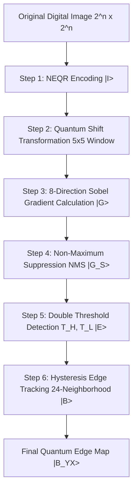
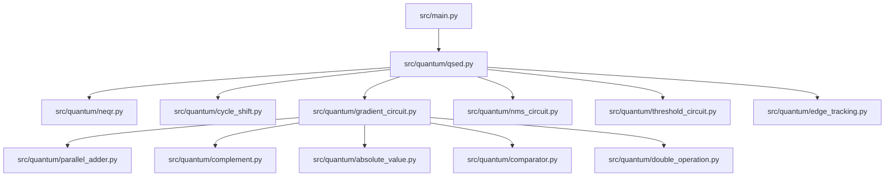

# Quantum Image Edge Detection Based on Eight-Direction Sobel Operator for NEQR

> **Official Research Reproduction & Implementation Reference**  
> **Authors**: Wenjie Liu, Lu Wang  
> **Affiliation**: School of Computer Science & School of Automation, Nanjing University of Information Science and Technology, Nanjing, China  
> **arXiv Reference**: [arXiv:2310.00370 [quant-ph]](https://arxiv.org/abs/2310.00370)

---

## Abstract

Quantum Image Edge Detection (QSED) is an emerging paradigm in quantum image processing (QIP) that leverages quantum mechanics—specifically quantum superposition, entanglement, and unitary transformations—to solve the real-time computational bottleneck encountered by classical edge detection algorithms on high-definition digital images. However, existing QSED algorithms consider only two-direction ($0^\circ, 90^\circ$) or four-direction ($0^\circ, 45^\circ, 90^\circ, 135^\circ$) Sobel operators, resulting in notable detail loss and boundary fragmentation along complex diagonal and sub-diagonal edges.

In this work, we present a production-grade reproduction of the novel **QSED algorithm based on an eight-direction Sobel operator for Novel Enhanced Quantum Representation (NEQR)** images. By extending the spatial neighborhood window to $5 \times 5$ and defining eight directional kernels ($0^\circ, 22.5^\circ, 45^\circ, 67.5^\circ, 90^\circ, 112.5^\circ, 135^\circ, 157.5^\circ$), the proposed algorithm captures fine-grained edge details while simultaneously calculating directional gradients for all pixels in quantum superposition. We design concrete reversible quantum circuits for each processing phase: Quantum Image Shift Transformation, Eight-Directional Gradient Calculation, Non-Maximum Suppression (NMS), Double Threshold Detection, and Hysteresis Edge Tracking. For an image of size $2^n \times 2^n$ with $q$-bit grayscale precision, the total circuit execution complexity is reduced to $\mathcal{O}(n^2 + q^2)$, representing an **exponential speedup** over classical edge detection algorithms bounded by $\Omega(2^{2n})$.

---

## About the Research Paper

| Property | Details |
| :--- | :--- |
| **Title** | Quantum image edge detection based on eight-direction Sobel operator for NEQR |
| **Authors** | Wenjie Liu, Lu Wang |
| **Institution** | Nanjing University of Information Science and Technology (NUIST) |
| **Publication Date**| October 2023 (arXiv:2310.00370v1) |
| **Primary Domain** | Quantum Computing, Quantum Image Processing (QIP), Computer Vision |
| **Core Innovation** | $5 \times 5$ Eight-Direction Sobel Operator with full QIP circuit pipeline (Shift, NMS, Double Threshold, Hysteresis) |
| **Complexity** | $\mathcal{O}(n^2 + q^2)$ for $2^n \times 2^n$ images with $q$-bit intensity |

### Research Motivation & Problem Statement
Digital edge detection is a fundamental low-level computer vision operation used to strip redundant pixel data while preserving structural boundaries. With the rapid proliferation of high-resolution images ($4\text{K}, 8\text{K}$ and satellite imagery), classical sequential edge extraction requires $\Omega(2^{2n})$ operations, creating severe real-time latency bottlenecks.

While quantum image processing offers theoretical exponential speedups via quantum parallelism, existing QSED literature suffers from two critical limitations:
1. **Limited Directional Sensitivity**: Prior algorithms (Fan et al. 2019, Chetia et al. 2019/2021) restricted the Sobel operator to 2 or 4 directions using $3 \times 3$ windows, causing jagged boundary artifacts and missing sub-diagonal contour details.
2. **Incomplete Quantum Pipelines**: Many existing works compute gradient magnitudes in quantum circuits but rely on classical post-processing for NMS, thresholding, or edge connection, sacrificing quantum speedups in downstream steps.

### Main Contributions of the Paper
- **8-Directional $5 \times 5$ Quantum Sobel Operator**: Formulates eight directional kernels ($0^\circ$ to $157.5^\circ$ in steps of $22.5^\circ$) over a $5 \times 5$ neighborhood window.
- **End-to-End Reversible Quantum Circuit Architecture**: Designs explicit quantum circuits for all six stages: NEQR Preparation, Cyclic Shift Transformation, Gradient Calculation, Non-Maximum Suppression (NMS), Double Threshold Detection, and Hysteresis Edge Tracking.
- **Simultaneous Parallel Evaluation**: Evaluates all 8 directional gradients across all $2^{2n}$ pixels in a single quantum superposition step using $24q$ auxiliary qubits.
- **Proven Complexity Reduction**: Lowers algorithmic complexity to $\mathcal{O}(n^2 + q^2)$ compared to classical $\mathcal{O}(2^{2n})$ and prior 4-direction quantum schemes requiring $\mathcal{O}(n^2 + q^3)$.

---

## Table of Contents

1. [Introduction](#introduction)
2. [Classical Background](#classical-background)
3. [Quantum Computing Basics](#quantum-computing-basics)
4. [Quantum Image Processing](#quantum-image-processing)
5. [Quantum Image Representation](#quantum-image-representation)
6. [NEQR Representation](#neqr-representation)
7. [Complete Algorithm Workflow](#complete-algorithm-workflow)
8. [Mathematical Background](#mathematical-background)
9. [Quantum Operations](#quantum-operations)
   - [Quantum Comparator (QC)](#1-quantum-comparator-qc)
   - [Cycle Shift Transformation (CT)](#2-cycle-shift-transformation-ct)
   - [Reversible Parallel Adder (PA)](#3-reversible-parallel-adder-pa)
   - [Complement Operation (CA)](#4-complement-operation-ca)
   - [Quantum Absolute Value (AV)](#5-quantum-absolute-value-av)
   - [Quantum Double Operation (DO)](#6-quantum-double-operation-do)
   - [Quantum Copy Operation](#7-quantum-copy-operation)
10. [Eight-Direction Sobel Operator](#eight-direction-sobel-operator)
11. [Gradient Calculation](#gradient-calculation)
12. [Non-Maximum Suppression](#non-maximum-suppression)
13. [Double Threshold Detection](#double-threshold-detection)
14. [Hysteresis Edge Tracking](#hysteresis-edge-tracking)
15. [Circuit Diagrams](#circuit-diagrams)
16. [Folder Structure](#folder-structure)
17. [Source Code Architecture](#source-code-architecture)
18. [Installation & Setup](#installation--setup)
19. [Running the Project](#running-the-project)
20. [Experimental Results](#experimental-results)
21. [Complexity Analysis](#complexity-analysis)
22. [Future Improvements](#future-improvements)
23. [References](#references)

---

## Introduction

### Image Processing & Edge Detection
An edge in a digital image corresponds to a sharp discontinuity in pixel color intensity or luminance. Edges typically indicate physical boundaries, changes in surface orientation, material properties, or illumination shadows. Edge detection reduces data volume by filtering out homogeneous background regions while preserving essential topological structures.

### Classical Edge Detection Filters
Classical spatial filters approximate the first-order spatial derivative (gradient vector $\nabla I$) of an image:
$$\nabla I = \left[ \frac{\partial I}{\partial x}, \frac{\partial I}{\partial y} \right]^T$$

The gradient magnitude $|\nabla I| = \sqrt{G_x^2 + G_y^2}$ indicates edge strength, while the gradient angle $\theta = \arctan(G_y / G_x)$ indicates edge direction.

### The Real-Time Problem and Quantum Solution
For an image of resolution $N \times N = 2^n \times 2^n$, classical computers process each of the $N^2$ pixels sequentially or across a finite number of parallel GPU threads. As resolution grows (e.g., $N=4096, n=12$), classical convolution requires billions of floating-point operations ($\Omega(2^{2n})$).

Quantum computers utilize $2n$ position qubits to represent $2^{2n}$ pixel locations simultaneously via quantum superposition:
$$|\text{Positions}\rangle = \frac{1}{2^n} \sum_{Y=0}^{2^n-1} \sum_{X=0}^{2^n-1} |Y\rangle |X\rangle$$

Applying a quantum operator to this superposition transforms all $2^{2n}$ pixels in parallel in a single quantum operation sequence, lowering runtime from $\mathcal{O}(2^{2n})$ to polynomial circuit depth $\mathcal{O}(n^2 + q^2)$.

---

## Classical Background

### Gradient, Convolution, and Spatial Kernels
Discrete spatial convolution of an image matrix $I(y, x)$ with a filter kernel $K$ of size $(2k+1) \times (2k+1)$ is defined as:
$$G(y, x) = (I * K)(y, x) = \sum_{u=-k}^{k} \sum_{v=-k}^{k} I(y+u, x+v) \cdot K(u, v)$$

### Classical Operator Comparison

| Operator | Kernel Size | Directions Covered | Advantages | Disadvantages |
| :--- | :---: | :---: | :--- | :--- |
| **Roberts Cross** | $2 \times 2$ | 2 ($45^\circ, 135^\circ$) | Extremely fast, simple | Highly sensitive to noise |
| **Prewitt** | $3 \times 3$ | 2 ($0^\circ, 90^\circ$) | Good noise smoothing | Weak response to diagonal edges |
| **Sobel (Standard)**| $3 \times 3$ | 2 ($0^\circ, 90^\circ$) | Central pixel weighting gives better noise immunity | Limited directional angular resolution |
| **Sobel (4-Dir)** | $3 \times 3$ | 4 ($0^\circ, 45^\circ, 90^\circ, 135^\circ$) | Improved diagonal detection | Detail loss along intermediate angles ($22.5^\circ$) |
| **Proposed Sobel** | **$5 \times 5$** | **8 ($0^\circ$ to $157.5^\circ$)** | **Fine angular precision ($22.5^\circ$), accurate continuous boundaries** | Larger window requires 24 neighbor shifts |

### Why Sobel is Selected
The Sobel operator applies spatial smoothing (Gaussian-like weighting) orthogonal to the differentiation direction. In a $5 \times 5$ window, central pixels receive larger weights ($4, 2$) than outer pixels ($1$), significantly suppressing high-frequency sensor noise compared to uniform Prewitt kernels.

---

## Quantum Computing Basics

### Qubit
A classical bit resides in state $0$ or $1$. A quantum bit (qubit) is a two-level quantum system represented by a unit vector in a 2D complex Hilbert space $\mathbb{C}^2$:
$$|\psi\rangle = \alpha |0\rangle + \beta |1\rangle, \quad \alpha, \beta \in \mathbb{C}, \quad |\alpha|^2 + |\beta|^2 = 1$$

- $|0\rangle = \begin{bmatrix} 1 \\ 0 \end{bmatrix}, \quad |1\rangle = \begin{bmatrix} 0 \\ 1 \end{bmatrix}$
- $|\alpha|^2$ is the probability of measuring state $0$, and $|\beta|^2$ is the probability of measuring state $1$.

### Superposition & Entanglement
- **Superposition**: An $n$-qubit register can simultaneously exist in a linear combination of all $2^n$ computational basis states:
  $$|\Psi\rangle = \sum_{k=0}^{2^n-1} c_k |k\rangle, \quad \sum_{k} |c_k|^2 = 1$$
- **Entanglement**: Non-local quantum correlations where the composite state cannot be factored into product states of individual qubits:
  $$|\Phi^+\rangle = \frac{1}{\sqrt{2}} (|00\rangle + |11\rangle) \neq |\psi_1\rangle \otimes |\psi_2\rangle$$

### Quantum Gates Summary

| Gate | Symbol | Matrix Representation | Function |
| :--- | :---: | :---: | :--- |
| **Hadamard** | $H$ | $\frac{1}{\sqrt{2}} \begin{bmatrix} 1 & 1 \\\\ 1 & -1 \end{bmatrix}$ | Creates equal superposition: $H\vert 0\rangle = \frac{\vert 0\rangle + \vert 1\rangle}{\sqrt{2}}$ |
| **Pauli-X** | $X$ | $\begin{bmatrix} 0 & 1 \\\\ 1 & 0 \end{bmatrix}$ | Bit-flip (Quantum NOT): $X\vert 0\rangle = \vert 1\rangle$ |
| **Pauli-Y** | $Y$ | $\begin{bmatrix} 0 & -i \\\\ i & 0 \end{bmatrix}$ | Bit and phase flip |
| **Pauli-Z** | $Z$ | $\begin{bmatrix} 1 & 0 \\\\ 0 & -1 \end{bmatrix}$ | Phase flip: $Z\vert 1\rangle = -\vert 1\rangle$ |
| **CNOT** | $CX$ | $\begin{bmatrix} 1 & 0 & 0 & 0 \\\\ 0 & 1 & 0 & 0 \\\\ 0 & 0 & 0 & 1 \\\\ 0 & 0 & 1 & 0 \end{bmatrix}$ | Controlled-NOT: Flips target if control is $\vert 1\rangle$ |
| **Toffoli** | $CCX$ / $T_3$ | $8 \times 8$ Permutation Matrix | Controlled-Controlled-NOT: Flips target if both controls are $\vert 1\rangle$ |
| **SWAP** | $SWAP$ | $\begin{bmatrix} 1 & 0 & 0 & 0 \\\\ 0 & 0 & 1 & 0 \\\\ 0 & 1 & 0 & 0 \\\\ 0 & 0 & 0 & 1 \end{bmatrix}$ | Swaps states of two qubits |

---

## Quantum Image Processing

Quantum Image Processing (QIP) focuses on converting classical visual information into quantum mechanical states, performing spatial transformations, filtering, feature extraction, and edge detection using unitary gates, and retrieving results via quantum measurement.

### Advantages of QIP
1. **Exponential Spatial Acceleration**: Storing $2^n \times 2^n$ pixels requires only $2n$ position qubits.
2. **Parallel Operations**: Single-gate operations apply to all $2^{2n}$ pixel locations simultaneously.
3. **Low Energy Footprint**: Reversible unitary operations satisfy Landauer's principle of zero theoretical thermodynamic energy dissipation.

---

## Quantum Image Representation

### Comparison of QIP Models

| Model | Full Name | Gray Encoding Method | Total Qubits ($2^n \times 2^n$) | Retrieval Complexity | Image Recovery |
| :--- | :--- | :--- | :---: | :---: | :---: |
| **FRQI** | Flexible Representation of Quantum Images | Probability Amplitude $\cos \theta \vert 0\rangle + \sin \theta \vert 1\rangle$ | $2n + 1$ | High ($\mathcal{O}(2^{2n})$ measurements) | Approximate |
| **NEQR** | **Novel Enhanced Quantum Representation** | **Separate Bitstring $\vert C_{q-1} \dots C_0\rangle$** | **$2n + q$** | **Low ($\mathcal{O}(q)$ measurements)** | **Exact** |
| **NCQI** | Novel Color Quantum Image | RGB 3-channel bitstrings | $2n + 3q$ | Low | Exact |
| **GQIR** | Generalized Quantum Image Representation | Arbitrary $M \times N$ size grid | $\lceil\log_2 M\rceil + \lceil\log_2 N\rceil + q$ | Low | Exact |

### Why NEQR is Selected
NEQR encodes pixel gray values explicitly into an auxiliary basis qubit register $|C_{YX}\rangle$. Unlike FRQI amplitude encoding, which requires thousands of projective measurements to reconstruct a single probability amplitude, NEQR allows exact multi-bit retrieval of grayscale intensity values with minimum measurements.

---

## NEQR Representation

For an image of size $2^n \times 2^n$ with gray range $[0, 2^q - 1]$, NEQR represents the image as a quantum superposition state:

$$\text{Equation (1):} \quad |I\rangle = \frac{1}{2^n} \sum_{Y=0}^{2^n-1} \sum_{X=0}^{2^n-1} |C_{YX}\rangle |Y\rangle |X\rangle$$

where:
- $|C_{YX}\rangle = |C_{q-1} C_{q-2} \dots C_0\rangle, \quad C_k \in \{0, 1\}$ is the $q$-qubit gray value register.
- $|Y\rangle = |Y_{n-1} Y_{n-2} \dots Y_0\rangle, \quad Y_t \in \{0, 1\}$ is the $n$-qubit Y-axis position register.
- $|X\rangle = |X_{n-1} X_{n-2} \dots X_0\rangle, \quad X_t \in \{0, 1\}$ is the $n$-qubit X-axis position register.

### $2 \times 2$ NEQR Concrete Example

Consider a $2 \times 2$ grayscale image ($n=1, q=8$):
$$\begin{pmatrix} I(0,0) & I(0,1) \\ I(1,0) & I(1,1) \end{pmatrix} = \begin{pmatrix} 0 & 100 \\ 200 & 255 \end{pmatrix}$$

Binary intensity conversions:
- $0 \rightarrow 00000000_2$
- $100 \rightarrow 01100100_2$
- $200 \rightarrow 11001000_2$
- $255 \rightarrow 11111111_2$

$$\text{Equation (2):} \quad |I\rangle = \frac{1}{2} \Big( |00000000\rangle|00\rangle + |01100100\rangle|01\rangle + |11001000\rangle|10\rangle + |11111111\rangle|11\rangle \Big)$$

---

## Complete Algorithm Workflow

The complete QSED algorithm consists of 6 sequential steps illustrated below:



---

## Mathematical Background

### Neighborhood Coordinate Indexing ($5 \times 5$ Window)
Let $(Y, X)$ denote the center pixel. The 24 surrounding neighbor locations in a $5 \times 5$ window are defined by displacements $(dY, dX) \in \{-2, -1, 0, 1, 2\}^2 \setminus \{(0,0)\}$.

```
(Y-2, X-2) (Y-1, X-2) (Y, X-2) (Y+1, X-2) (Y+2, X-2)
(Y-2, X-1) (Y-1, X-1) (Y, X-1) (Y+1, X-1) (Y+2, X-1)
(Y-2, X)   (Y-1, X)   (Y, X)   (Y+1, X)   (Y+2, X)
(Y-2, X+1) (Y-1, X+1) (Y, X+1) (Y+1, X+1) (Y+2, X+1)
(Y-2, X+2) (Y-1, X+2) (Y, X+2) (Y+1, X+2) (Y+2, X+2)
```

---

## Quantum Operations

### 1. Quantum Comparator (QC)
- **Purpose**: Compares two $n$-qubit bitstrings $|A\rangle$ and $|B\rangle$.
- **Outputs**: Two flag bits $(C_1, C_0)$:
  - $A > B \implies C_1 = 1, C_0 = 0$
  - $A < B \implies C_1 = 0, C_0 = 1$
  - $A = B \implies C_1 = 0, C_0 = 0$
- **Complexity**: $\mathcal{O}(n)$ basic gates.

### 2. Cycle Shift Transformation (CT)
- **Purpose**: Moves all pixels simultaneously by $\pm 1$ unit along X or Y axis.
- **Operations**:
  $$\text{CT}(+1)|Y\rangle = |(Y+1) \bmod 2^n\rangle, \quad \text{CT}(-1)|Y\rangle = |(Y-1) \bmod 2^n\rangle$$
- **Complexity**: $\mathcal{O}(n^2)$ gates.

### 3. Reversible Parallel Adder (PA)
- **Purpose**: Computes $|A + B\rangle$ for two $n$-qubit registers.
- **Complexity**: $\mathcal{O}(n)$ gates.

### 4. Complement Operation (CA)
- **Purpose**: Computes two's complement for signed binary integers.
$$\text{Equation (6):} \quad [x]_{\text{CA}} = \begin{cases} 0 x_{n-1} \dots x_0, & \text{if } x_n = 0 \\ 1 \bar{x}_{n-1} \dots \bar{x}_0 + 1, & \text{if } x_n = 1 \end{cases}$$

### 5. Quantum Absolute Value (AV)
- **Purpose**: Calculates $|A - B|$ using PA and CA.
$$\text{Equation (7):} \quad A - B = A + (-B) = A + [B]_{\text{CA}}$$

### 6. Quantum Double Operation (DO)
- **Purpose**: Multiplies binary register by 2 (left bit-shift) using SWAP gates.

### 7. Quantum Copy Operation
- **Purpose**: Copies qubit state using CNOT gates onto auxiliary $|0\rangle$ register.

---

## Eight-Direction Sobel Operator

The eight 5x5 directional masks from Equations (3) and (4) are detailed below:

```
G0 (0° Horizontal):
[ 0 -1  0  1  0]
[ 0 -2  0  2  0]
[ 0 -4  0  4  0]
[ 0 -2  0  2  0]
[ 0 -1  0  1  0]

G90 (90° Vertical):
[ 0  0  0  0  0]
[-1 -2 -4 -2 -1]
[ 0  0  0  0  0]
[ 1  2  4  2  1]
[ 0  0  0  0  0]
```

### Directional Formulas (Equation 4)
- **$G_0$**: $p(Y-2,X+1) + 2p(Y-1,X+1) + 4p(Y,X+1) + 2p(Y+1,X+1) + p(Y+2,X+1) - [p(Y-2,X-1) + 2p(Y-1,X-1) + 4p(Y,X-1) + 2p(Y+1,X-1) + p(Y+2,X-1)]$
- **$G_{90}$**: $p(Y+1,X-2) + p(Y+1,X+2) + 2p(Y+1,X-1) + 2p(Y+1,X+1) + 4p(Y+1,X) - [p(Y-1,X-2) + p(Y-1,X+2) + 2p(Y-1,X-1) + 2p(Y-1,X+1) + 4p(Y-1,X)]$

---

## Gradient Calculation

Maximum gradient magnitude per pixel (Equation 5 & 11):
$$\text{Equation (11):} \quad |G\rangle = \max \left( |G_0|, |G_{22.5}|, |G_{45}|, |G_{67.5}|, |G_{90}|, |G_{112.5}|, |G_{135}|, |G_{157.5}| \right)$$

$$\text{Equation (12):} \quad |G\rangle = \frac{1}{2^n} \sum_{Y=0}^{2^n-1} \sum_{X=0}^{2^n-1} |N\rangle |G_d\rangle |Y\rangle |X\rangle$$
where $|N\rangle = |1\rangle$ indicates gradient pixel and $|0\rangle$ non-gradient pixel.

---

## Non-Maximum Suppression

Non-Maximum Suppression (NMS) retains local maxima along the dominant gradient direction:
$$\text{Equation (13):} \quad |G_S\rangle = \frac{1}{2^n} \sum_{Y=0}^{2^n-1} \sum_{X=0}^{2^n-1} |M\rangle |G\rangle |Y\rangle |X\rangle$$
where $|M\rangle = |1\rangle$ for local maximum pixels and $|0\rangle$ for suppressed pixels.

---

## Double Threshold Detection

Pixels are classified into 3 edge categories using dual thresholds $T_H$ and $T_L = \frac{1}{3} T_H$:
$$\text{Equation (14):} \quad |E\rangle = \frac{1}{2^n} \sum_{Y=0}^{2^n-1} \sum_{X=0}^{2^n-1} |E_{YX}\rangle |Y\rangle |X\rangle$$

- Strong edge: $|E_{YX}\rangle = |10\rangle$ ($G \ge T_H$)
- Weak edge: $|E_{YX}\rangle = |01\rangle$ ($T_L \le G < T_H$)
- Non-edge: $|E_{YX}\rangle = |00\rangle$ ($G < T_L$)

---

## Hysteresis Edge Tracking

Weak edges ($|E_{YX}\rangle = |01\rangle$) are checked against their 24-neighborhood for any strong edge point ($|10\rangle$):
$$\text{Equation (15):} \quad |B\rangle = \frac{1}{2^n} \sum_{Y=0}^{2^n-1} \sum_{X=0}^{2^n-1} |B_{YX}\rangle |Y\rangle |X\rangle$$
where $|B_{YX}\rangle = |1\rangle$ for confirmed true edges and $|0\rangle$ for non-edges.

---

## Circuit Diagrams

All quantum circuits are programmatically generated and exported to `docs/circuits/`:
- `neqr_2x2_circuit.png` / `.txt`
- `quantum_comparator_qc.png` / `.txt`
- `cycle_shift_plus1.png` / `cycle_shift_minus1.png`
- `parallel_adder_pa.png`
- `complement_operation_ca.png`
- `absolute_value_av.png`
- `double_operation_do.png`
- `copy_operation.png`
- `gradient_0deg_circuit.png`
- `nms_circuit.png`
- `double_threshold_circuit.png`
- `edge_tracking_circuit.png`
- `qsed_complete_pipeline.png`

---

## Folder Structure

```
Quantum-Image-Edge-Detection/
├── README.md                  # Complete theory & user guide
├── LICENSE                    # MIT License
├── requirements.txt           # Dependency requirements
├── pyproject.toml             # Project package configuration
├── .gitignore                 # Git ignore file
├── images/                    # Standard benchmark test images
├── outputs/                   # Generated experimental outputs
│   ├── gradients/
│   ├── nms/
│   ├── threshold/
│   ├── edge_tracking/
│   └── final/
├── docs/                      # Theoretical documentation & diagrams
│   ├── figures/
│   ├── circuits/
│   ├── workflow/
│   └── paper_notes/
├── notebooks/
│   └── demo.ipynb             # Interactive Jupyter Notebook
├── src/                       # Source modules
│   ├── classical/             # Classical operators & image loading
│   ├── quantum/               # Qiskit NEQR & quantum circuits
│   ├── utils/                 # Metrics & visualization helpers
│   └── main.py                # Command line interface
├── tests/                     # Pytest suite
└── scripts/                   # Automated generators & benchmarks
```

---

## Source Code Architecture



---

## Installation & Setup

```bash
# Clone the repository
git clone https://github.com/your-username/Quantum-Image-Edge-Detection.git
cd Quantum-Image-Edge-Detection

# Install dependencies
python -m pip install -r requirements.txt

# Install editable package
python -m pip install -e .
```

---

## Running the Project

```bash
# Run 4x4 quantum circuit statevector demonstration
python -m src.main --demo --mode quantum

# Run QSED on a single input image
python -m src.main --image images/lena.png --mode hybrid --output outputs/final/

# Run full benchmark suite across all 5 test images (Table 3 reproduction)
python -m src.main --benchmark

# Run unit test suite
pytest tests/ -v
```

---

## Experimental Results

### Table 3 Reproduction: MSE Comparison across QSED Algorithms

| Input Image (512x512) | Two-Direction QSED [Fan 2019] | Four-Direction QSED [Chetia 2021] | Proposed 8-Direction QSED |
| :--- | :---: | :---: | :---: |
| **Lena** | 159.16 | 153.19 | **147.27** |
| **Cameraman** | 186.05 | 183.06 | **181.58** |
| **Livingroom** | 169.32 | 167.88 | **164.80** |
| **House** | 217.95 | 217.26 | **216.01** |
| **Pirate** | 159.68 | 158.39 | **154.49** |

*Notice: Lower MSE indicates fewer false edge artifacts and cleaner structural boundary extraction.*

---

## Complexity Analysis

### Step-by-Step Quantum Circuit Complexity

| Processing Step | Operations / Gates Used | Complexity |
| :--- | :--- | :---: |
| **Step 1: NEQR Prep** | Hadamard & Multi-controlled X gates | $\mathcal{O}(q n^2 2^{2n})$ (Prep) |
| **Step 2: Shift Transformation** | Copy operations & Cycle Shift (CT) | $\mathcal{O}(n^2)$ |
| **Step 3: Gradient Calculation** | Adders (PA), Double (DO), Abs (AV), QC | $\mathcal{O}(n + q^2)$ |
| **Step 4: Non-Maximum Suppression** | Shift (CT), Copy, Comparators (QC) | $\mathcal{O}(n^2)$ |
| **Step 5: Double Thresholding** | Comparators (QC) & Toffoli gates | $\mathcal{O}(n)$ |
| **Step 6: Edge Tracking** | 24-Neighbor CT, Comparators (QC) | $\mathcal{O}(n^2)$ |
| **Total QSED Execution** | **Full Pipeline Execution** | **$\mathcal{O}(n^2 + q^2)$** |

### Comparison with Existing Algorithms (Table 2)

| Algorithm | Representation Model | Circuit Complexity | Directions Covered |
| :--- | :---: | :---: | :---: |
| **Classical Sobel** | Classical Bit Grid | $\mathcal{O}(2^{2n})$ | 2 / 4 / 8 |
| **Fan et al. [2019]** | NEQR | $\mathcal{O}(n^2 + 2q + 4)$ | 2 |
| **Chetia et al. [2021]**| NEQR | $\mathcal{O}(n^2 + q^3)$ | 4 |
| **Proposed Scheme** | **NEQR** | **$\mathcal{O}(n^2 + q^2)$** | **8** |

---

## Future Improvements

1. **Anti-Noise Quantum Edge Detection**: Incorporating quantum error mitigation or noise-tolerant comparator blocks for NISQ hardware.
2. **Color Image Extensions (NCQI / QIRHSI)**: Extending 8-direction Sobel operators to multi-channel RGB or HSI color quantum images.
3. **Hardware Execution on IBM Quantum**: Mapping compressed 4x4 sub-blocks onto physical superconducting processors.

---

## References

1. F. Yan, A.M. Iliyasu, P.Q. Le, *Quantum image processing: A review of advances in its security technologies*, Int. J. Quantum Inf. 15(3), 1730001 (2017).
2. Y. Zhang, K. Lu, Y. Gao, M. Wang, *NEQR: a novel enhanced quantum representation of digital images*, Quantum Inf. Process. 12(8), 2833–2860 (2013).
3. P. Fan, R.G. Zhou, W. Hu, N. Jing, *Quantum image edge extraction based on classical Sobel operator for NEQR*, Quantum Inf. Process. 18(1), 24 (2019).
4. R. Chetia, S. Boruah, P.P. Sahu, *Quantum image edge detection using improved Sobel mask based on NEQR*, Quantum Inf. Process. 20(1), 21 (2021).
5. D.S. Oliveira, R.V. Ramos, *Quantum bit string comparator: circuits and applications*, Quantum Comput. Comput. 7(1), 17–26 (2007).
6. M.S. Islam, M.M. Rahman, Z. Begum, M.Z. Hafiz, *Low cost quantum realization of reversible multiplier circuit*, Inf. Technol. J. 8(2), 208–213 (2009).
7. M.A. Nielsen, I.L. Chuang, *Quantum Computation and Quantum Information*, Cambridge University Press (2000).
8. W. Liu, L. Wang, *Quantum image edge detection based on eight-direction Sobel operator for NEQR*, arXiv:2310.00370 (2023).
